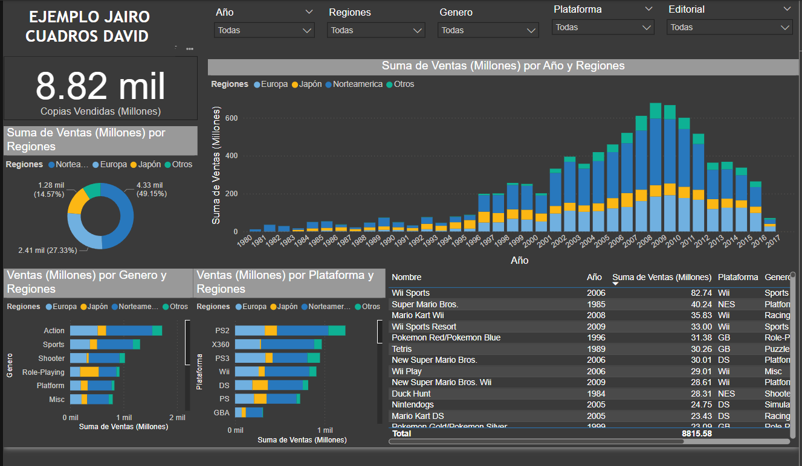

He rescatado una tabla de datos de excel de videojuegos, en el cual realice la limpieza de datos en el Power Query para poder visualizar
los KPIs en el dashboard, el archivo se encuentra en Ejemplo1.pbix

